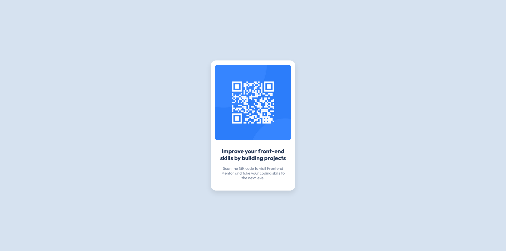

# Frontend Mentor - QR code component solution

This is a solution to the [QR code component challenge on Frontend Mentor](https://www.frontendmentor.io/challenges/qr-code-component-iux_sIO_H). Frontend Mentor challenges help you improve your coding skills by building realistic projects.

## Hello

This is my first project on Frontend Mentor. As I want to imporve my skills, I will gladly accept all advices and criticsm.

### Screenshot

### Links

- Solution URL: [Add solution URL here](https://your-solution-url.com)
- Live Site URL: [Add live site URL here](https://karolbanat.github.io/qr-code-component-main/)

## Author

- Frontend Mentor - [@yourusername](https://www.frontendmentor.io/profile/karolbanat)
